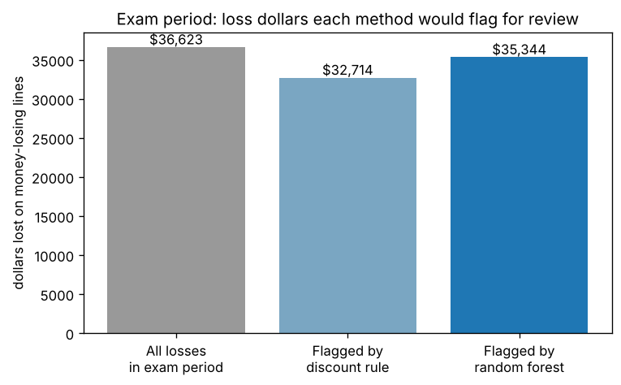

# Which order lines lose money? An ML pipeline example

A 16-step, gated machine-learning pipeline on retail order data (scikit-learn + XGBoost 3.4.1). CPU only, runs in about 30 seconds, $0.

## The question
Discounts above 20% almost always lose money, and a one-line rule already catches most of those. **Can a model also find the losing lines hiding in the 1-20% discount range?** (14% of those lines lose money.)

## Headline result (final exam: the newest 20% of orders, Jul-Dec 2017, scored once)

| Method | Loss lines caught | Loss dollars flagged | PR-AUC |
|---|---|---|---|
| Never flag (dummy) | 0% | $0 | 0.181 |
| Rule: discount > 20% | 70% (253 of 362) | $32.7K of $36.6K (89%) | 0.735 |
| **Random forest (selected)** | **83% (300 of 362)** | **$35.3K of $36.6K (96.5%)** | **0.953** |
| XGBoost | 79%* | not computed | 0.955 |
| Logistic regression | 75%* | not computed | 0.941 |

*XGBoost and logistic are shown at the default 0.5 cut-off, not the tuned one, so compare their PR-AUC, not that column.

- **Business view:** the model flags about $2.6K more of the loss dollars than the rule in six months, on a small store. Flagging only points a reviewer at a line; it does not save the money by itself.
- **Cost of flags:** 42 false alarms, carrying $1.0K of profit that a reviewer would question for nothing (the rule: 7 false alarms, $0.3K).



## Honest caveats
- **Threshold missed its target:** I chose a cut-off on validation to keep flags 90% right; on the exam they were right 87.7% of the time.
- **Three models are tied:** logistic, random forest and XGBoost are within 0.014 PR-AUC. The gain over the rule is real; the ranking among the three is not. The random forest won because of a selection rule fixed before training (a simpler model within 0.005 PR-AUC wins).
- **One dataset:** a single store's orders, 2014-2017 (Superstore-style data). Not proof that it generalizes.

## What makes the process trustworthy
- **Chronological split:** train on the past, tune on the next period, exam on the newest. A random split would let the model see the future.
- **Leakage excluded:** `profit`, `cost` and `margin_pct` are built from the answer, so they are not features.
- **Real baseline:** the models must beat the discount rule, not only a dummy.
- **Locked exam:** the final test set is fingerprinted and scored once; every rule was written down before modeling.
- **Everything logged:** see `ml_pipeline/PIPELINE.md` for every step, gate, decision and figure explanation, plus a monitoring plan.

## Run it
```bash
pip install -r requirements.txt
./run_all.sh          # runs steps 1-17 in order; results land in ml_pipeline/
```
Data: `data/clean/lines.parquet` (9,994 order lines, from my `pricing-promo-analysis` repo).

## Layout
- `ml_pipeline/01_eda.py` ... `06_business_impact.py` - the pipeline, in order
- `ml_pipeline/preprocess.py`, `models.py`, `metrics.py` - shared code
- `ml_pipeline/guard.py` - checks that block leakage and a second look at the exam set
- `ml_pipeline/figures/` - every chart
